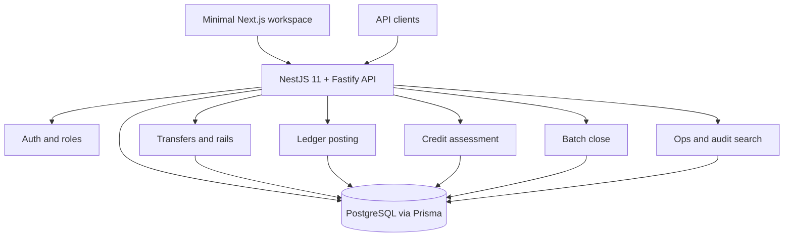
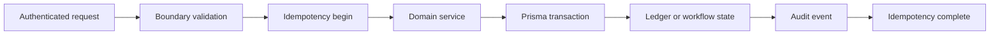

# Ledger Credit System

[](https://nodejs.org/)
[](https://nestjs.com/)
[](https://www.typescriptlang.org/)
[](https://www.prisma.io/)
[](https://www.postgresql.org/)
[](https://vitest.dev/)
[](https://docker.com/)

**A TypeScript finance backend** demonstrating append-only double-entry ledger posting, idempotent transfer orchestration, manual credit review, external rail simulation, and batch close processing.

> **Development Status: Source-backed documentation refresh - June 17, 2026**
> Current code includes NestJS backend modules, Prisma schema and migrations, minimal Next.js workspace, OpenAPI contract workspace, Java API skeleton, and CI verification. This is not a production-readiness claim.
>
> **Documentation:** [`docs/README.md`](docs/README.md) | **API Contract:** [`docs/05-api/api-contract.md`](docs/05-api/api-contract.md) | **Source Status:** [`docs/reference/repository-status.md`](docs/reference/repository-status.md)

---

## Why This Project Exists

Finance backend code must make retries safe, money exact, state changes explainable, and operational recovery auditable. Ledger Credit System is a compact source-backed implementation of those patterns: transfers require idempotency, money uses minor units, ledger movements use journal entries and postings, credit decisions retain snapshots and rationale, and operators can inspect or retry failure paths.

## Key Architecture Decisions

| Decision | Rationale | ADR |
|---|---|---|
| Modular monolith | Keeps finance workflows in one deployable while preserving module boundaries | [`ADR-001`](docs/04-architecture/adr/ADR-001-modular-monolith.md) |
| Append-only ledger | Reconstructs money movement from journal entries and postings | [`ADR-002`](docs/04-architecture/adr/ADR-002-append-only-ledger.md) |
| Durable idempotency keys | Prevents duplicate externally triggered writes under retry | [`ADR-003`](docs/04-architecture/adr/ADR-003-idempotency-keys.md) |
| External rail adapters | Models provider workflows with simulator/mock-bank adapters without overstating settlement scope | [`ADR-004`](docs/04-architecture/adr/ADR-004-external-rail-adapters.md) |

## System Architecture Overview



## End-To-End Finance Workflow



## Key Features And Business Value

| Feature | Technical implementation | Business value |
|---|---|---|
| Exact money model | `amountMinor`, BigInt, and `Money` value object | Avoids floating-point drift |
| Double-entry ledger | `JournalEntry` and `Posting` records | Reconstructable money movement |
| Idempotent transfers | `IdempotencyRecord` and request hash checks | Retry-safe external writes |
| External rail simulation | Provider adapter boundary and callbacks | Tests interbank-style flows locally |
| Credit review | Snapshots, score thresholds, reviewer decision fields | Traceable credit decisions |
| Batch close | `BatchRun`, `BatchRunItem`, retry paths | Operational recovery for scheduled work |
| Audit search | `AuditEvent` and ops query routes | Incident review and accountability |

## Verified Project Metrics

| Metric | Value | Evidence |
|---|---:|---|
| GitNexus files | 219 | [`engineering-metrics.md`](docs/reference/engineering-metrics.md) |
| GitNexus nodes | 1,273 | [`engineering-metrics.md`](docs/reference/engineering-metrics.md) |
| GitNexus edges | 3,026 | [`engineering-metrics.md`](docs/reference/engineering-metrics.md) |
| GitNexus flows | 78 | [`engineering-metrics.md`](docs/reference/engineering-metrics.md) |
| Nest route methods | 24 | [`api-route-inventory.md`](docs/reference/api-route-inventory.md) |
| Prisma models | 21 | [`db-schema.md`](docs/06-database/db-schema.md) |
| Prisma enums | 15 | [`db-schema.md`](docs/06-database/db-schema.md) |
| Prisma migrations | 5 | [`migration-guide.md`](docs/06-database/migration-guide.md) |
| TS test/spec files | 34 | [`test-strategy.md`](docs/09-testing/test-strategy.md) |
| CI jobs | 4 | [`.github/workflows/ci.yml`](.github/workflows/ci.yml) |

## Modular Backend Architecture

| Module | Responsibility |
|---|---|
| Auth | Login, refresh, logout, principals, roles, external identities |
| Accounts | Balance and ledger-entry read APIs |
| Ledger | Journal entries, postings, projections |
| Transfers | Internal/external transfer orchestration |
| Credit | Credit profile snapshots, scoring, review lifecycle |
| Batch | End-of-day interest close and retryable work |
| Ops | Transfer inspection, redrive, reconcile, audit search, credit review |
| Audit | Append-only audit event recording/search |

## Quick Start

```powershell
npm ci
docker compose up -d postgres
Copy-Item .env.example .env
npm run prisma:generate
npm run prisma:migrate:dev
npm run prisma:seed
npm run start:dev
```

Health and docs:

```text
http://localhost:3000/api/v1/health/live
http://localhost:3000/api/v1/health/ready
http://localhost:3000/docs
```

## Testing And Quality

```powershell
npm run lint
npm run typecheck
npm run test:unit
npm run test:integration
npm run contracts:check
npm run web:typecheck
npm run web:lint
npm run web:test
npm run java:test
npm run verify:full
```

`npm run verify:full` may require Docker because it bootstraps PostgreSQL before running Prisma, lint, typecheck, unit tests, integration tests, build, and benchmark smoke checks.

## CI And Operations

The repository has one GitHub Actions workflow with four jobs: backend verification, contract check, Java API skeleton tests, and web workspace checks. Runtime operations are documented in [`docs/11-operations/runtime-operations.md`](docs/11-operations/runtime-operations.md). The repository does not currently contain deployment target proof.

## Documentation

| Area | Primary doc |
|---|---|
| Foundation | [`docs/00-overview/project-foundation.md`](docs/00-overview/project-foundation.md) |
| Business rules | [`docs/01-business/business-rules.md`](docs/01-business/business-rules.md) |
| Product requirements | [`docs/02-product/prd.md`](docs/02-product/prd.md) |
| System requirements | [`docs/03-requirements/srs.md`](docs/03-requirements/srs.md) |
| Architecture | [`docs/04-architecture/architecture.md`](docs/04-architecture/architecture.md) |
| API | [`docs/05-api/api-contract.md`](docs/05-api/api-contract.md) |
| Database | [`docs/06-database/db-schema.md`](docs/06-database/db-schema.md) |
| Flows | [`docs/07-flows/end-to-end-business-flow.md`](docs/07-flows/end-to-end-business-flow.md) |
| Testing | [`docs/09-testing/test-strategy.md`](docs/09-testing/test-strategy.md) |
| Deployment | [`docs/10-deployment/deployment-guide.md`](docs/10-deployment/deployment-guide.md) |
| Operations | [`docs/11-operations/admin-guide.md`](docs/11-operations/admin-guide.md) |
| Handover | [`docs/12-handover/handover-document.md`](docs/12-handover/handover-document.md) |

## Security And Auditability

- Auth uses JWT/session concepts, role guards, password hashing, token hashing, and optional OIDC verifier support.
- Runtime setup enables helmet, rate limiting, request correlation IDs, and pino header redaction.
- Current CORS config uses `origin: true`; restrict allowed origins before deployment.
- Transfers and credit assessment creation require idempotency keys.
- Ledger and audit records are treated as append-only source-of-truth history.
- External rail callback secrets and JWT secrets must be environment-specific outside local development.
