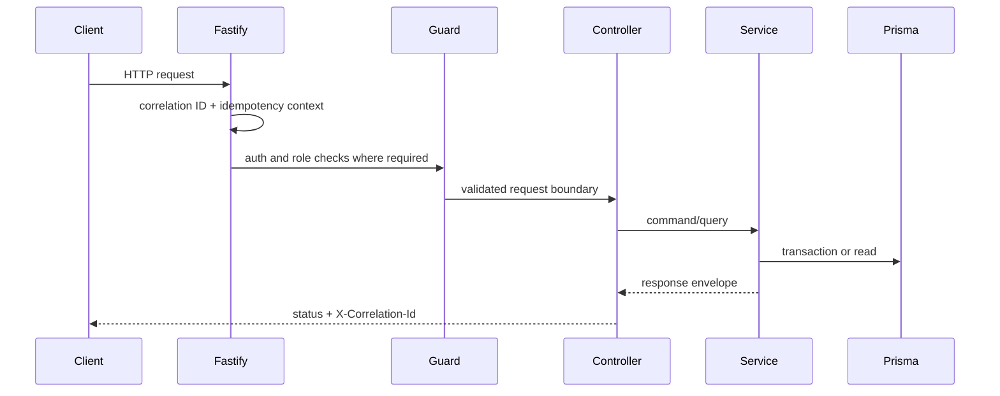

# Architecture

## 1. Architecture Style

Ledger Credit System is a modular monolith. `src/app.module.ts` composes shared infrastructure and domain modules into one NestJS/Fastify backend deployable.

## 2. Runtime Surface

| Surface | Current source |
|---|---|
| API prefix | `/api/v1` in `src/bootstrap.ts` |
| Swagger UI | `/docs` in `src/bootstrap.ts` |
| CORS | `origin: true` in `src/bootstrap.ts`; local/default permissive posture |
| Security headers | Fastify helmet registration |
| Rate limiting | Fastify rate limit using config values |
| Correlation ID | `X-Correlation-Id` hook in `src/bootstrap.ts` |
| Logger redaction | Authorization, cookie, and set-cookie paths in `src/app.module.ts` |

## 3. Module Map

| Module | Responsibility |
|---|---|
| `AuthModule` | Auth identity, guards, sessions, credentials, admin provisioning |
| `AuditModule` | Append-only audit event recording and search |
| `LedgerModule` | Balanced journal entries, postings, projections |
| `HealthModule` | Liveness and readiness probes |
| `AccountsModule` | Balance and ledger-entry read APIs |
| `TransfersModule` | Transfer creation, lookup, external rails, callbacks |
| `CreditModule` | Credit profile snapshots and assessment creation |
| `BatchModule` | End-of-day close and retryable batch items |
| `OpsModule` | Privileged transfer, batch, audit, and credit review actions |

## 4. Request Lifecycle

## 5. Money Movement Lifecycle

Transfer creation validates supported currency, idempotency key, account state, and request hash before posting ledger activity or coordinating an external rail provider. Ledger truth is represented by `JournalEntry` and `Posting`; projections support reads but do not replace ledger history.

## 6. Credit Decision Lifecycle

`CreditService` creates a profile snapshot, scores the assessment, records thresholds and policy version, and moves assessments through request, collection, score, under-review, approval, rejection, or failure states.

## 7. Batch Lifecycle

`BatchService` schedules and runs end-of-day close work, tracks `BatchRun` and `BatchRunItem` records, writes counts and failures, and exposes retry through ops routes.

## 8. Cross-Cutting Concerns

| Concern | Source-backed implementation |
|---|---|
| Money safety | `src/common/money/money.ts`, `amountMinor` fields |
| Idempotency | `src/common/idempotency/idempotency.service.ts`, `IdempotencyRecord` |
| Auditability | `src/modules/audit/audit.service.ts`, `AuditEvent` |
| Auth and roles | `src/common/auth/*`, `src/modules/auth/*` |
| Validation | Controller schemas and zod dependency |
| Configuration | `src/common/config/*`, `.env.example` |

## 9. Known Architecture Limits

- No live deployment target is documented in source.
- External settlement is simulator/mock-bank only.
- The web workspace is intentionally minimal.
- CORS must be tightened before a deployment that handles non-demo traffic.
- CI uses Node 22 while the backend Dockerfile uses Node 20.
