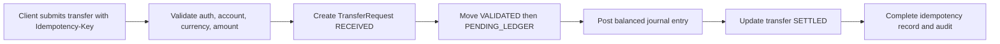
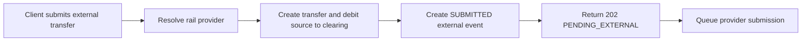
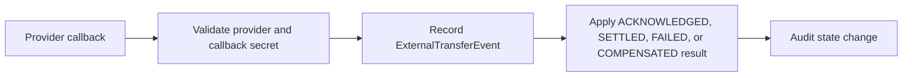
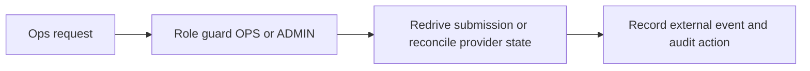
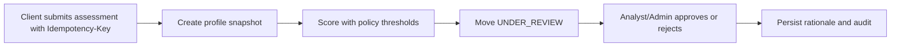
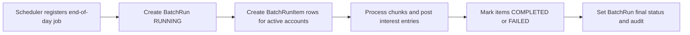
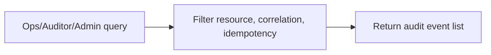
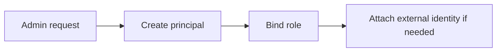

# End-To-End Business Flow

## Internal Transfer

Source: `src/modules/transfers/transfers.service.ts`, `src/modules/ledger/ledger.service.ts`.

## External Transfer With Simulator/Mock-Bank Rail

Source: `src/modules/transfers/transfers.service.ts`, `src/modules/transfers/external-rail.service.ts`.

## Provider Callback Ingestion

Source: `src/modules/transfers/external-rail.controller.ts`, `src/modules/transfers/external-rail.service.ts`.

## Transfer Redrive And Reconcile

Source: `src/modules/ops/ops.controller.ts`, `src/modules/transfers/external-rail.service.ts`.

## Credit Assessment Submission And Manual Review

Source: `src/modules/credit/credit.service.ts`, `src/modules/ops/ops.controller.ts`.

## End-Of-Day Interest Close Batch

Source: `src/modules/batch/batch.service.ts`.

## Audit Search

Source: `src/modules/ops/ops.controller.ts`, `src/modules/audit/audit.service.ts`.

## Admin Auth Provisioning

Source: `src/modules/auth/auth.controller.ts`, `src/modules/auth/auth-provisioning.service.ts`.
